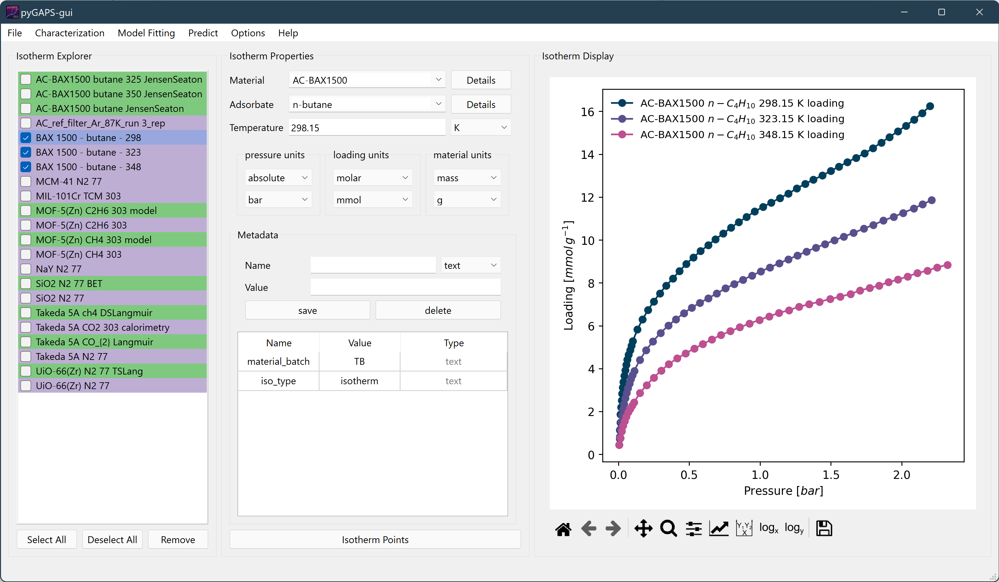

.. raw:: html

   

   <h1 align="center">
   
   <h1 align="center">pyGAPS-gui</h1>
   </h1>
   

========
Overview
========

pyGAPS-gui is a Graphical User Interface (GUI) for
`pyGAPS <https://github.com/pauliacomi/pyGAPS>`__. It can be used to
import, process and fit adsorption isotherms in various formats.

Download the latest version for your system in the
`releases <https://github.com/pauliacomi/pyGAPS-gui/releases>`__
section.

.. raw:: html

    
    

.. </a>
.. <a style="text-decoration:none" href="https://github.com/pauliacomi/pyGAPS-gui/releases/latest/download/pyGAPS-gui-macos.zip">
.. 

--------------

pyGAPS-gui is currently **alpha** software. Things may break and change
without warning. You have been warned.

--------------

Features
========

-  Advanced adsorption data import and manipulation.
-  Routine analysis such as BET/Langmuir surface area, t-plot, alpha-s,
   Dubinin plots etc.
-  Pore size distribution calculations for mesopores (BJH,
   Dollimore-Heal).
-  Pore size distribution calculations for micropores (Horvath-Kawazoe).
-  Pore size distribution calculations using DFT kernels
-  Isotherm model fitting (Henry, Langmuir, DS/TS Langmuir, etc..)
-  Isosteric enthalpy of adsorption calculation.
-  IAST calculations for binary and multicomponent adsorption.
-  Parsing to and from multiple formats such as Excel, CSV and JSON.
-  An sqlite database backend for storing and retrieving data.
-  Simple methods for isotherm graphing and comparison.

Installation for development
============================

To install the development version of pyGAPS-gui, pull this GitHub repo.

.. code:: bash

   git clone https://github.com/pauliacomi/pyGAPS-gui

Setup a virtual environment and install pyGAPS. For example using
``venv`` on linux: Due to some dependency hell, **pyGAPS-gui requires
Python 3.8**.

.. code:: bash

   cd pyGAPS-gui
   python -m venv ./.venv
   source ./.venv/bin/activate
   pip install .

Or using ``conda`` on Windows:

.. code:: pwsh

   cd pyGAPS-gui
   conda create -p ./.venv python=3.8
   conda activate ./.venv
   pip install .

Then run the app:

.. code:: bash

   pygapsgui
   # or
   python pyGAPS-gui.py
